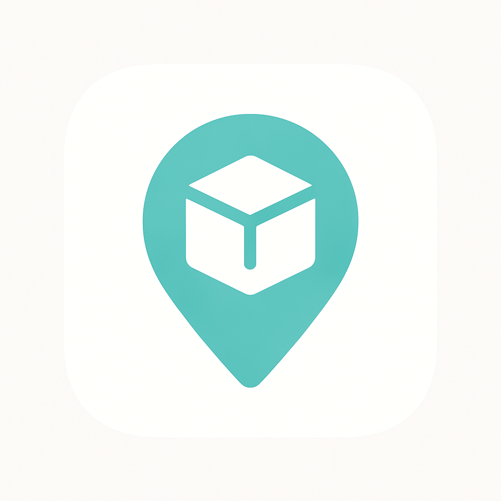

# Ittem MVP - 지역 기반 물건 대여 플랫폼

<div align="center">
  


**Flutter로 개발된 지역 기반 물건 대여 플랫폼 모바일 앱 MVP**

[](https://flutter.dev)
[](https://supabase.com)
[](LICENSE)

</div>

## 📱 프로젝트 소개

Ittem은 지역 커뮤니티 내에서 물건을 쉽게 빌려주고 빌릴 수 있는 플랫폼입니다. 당근마켓 스타일의 깔끔한 UI와 직관적인 사용자 경험을 제공합니다.

### ✨ 주요 기능

- 🗺️ **위치 기반 서비스**: GPS를 활용한 주변 아이템 검색 및 거리별 필터링
- 📱 **아이템 관리**: 물건 등록, 검색, 카테고리별 브라우징
- 💬 **실시간 채팅**: 대여자와 임대인 간 실시간 소통
- 🔍 **지도 연동**: Google Maps를 통한 시각적 아이템 탐색
- 👤 **사용자 프로필**: 신뢰도 점수, 리뷰, 대여 히스토리 관리
- 💳 **결제 시스템**: PortOne을 활용한 안전한 결제 처리
- 🔐 **소셜 로그인**: 카카오, 구글, 애플 로그인 지원

## 🏗️ 기술 스택

| 분야 | 기술 |
|------|------|
| **Frontend** | Flutter 3.9+, Material Design 3 |
| **Backend** | Supabase (PostgreSQL + PostGIS) |
| **상태 관리** | Riverpod |
| **네비게이션** | GoRouter |
| **지도** | Google Maps Flutter |
| **위치 서비스** | Geolocator, Geocoding |
| **로컬 저장소** | Hive |
| **결제** | PortOne (아임포트) |
| **환경 관리** | flutter_dotenv |

## 🚀 빠른 시작

### 📋 사전 요구사항

- [Flutter SDK](https://flutter.dev/docs/get-started/install) 3.9 이상
- [Android Studio](https://developer.android.com/studio) 또는 [VS Code](https://code.visualstudio.com/)
- Android SDK 및 에뮬레이터 (Android 개발용)

### ⚙️ 설치 및 설정

1. **저장소 클론**
   ```bash
   git clone https://github.com/your-username/ittem-mvp.git
   cd ittem-mvp
   ```

2. **의존성 설치**
   ```bash
   flutter pub get
   ```

3. **환경변수 설정**
   ```bash
   # .env.example을 참고하여 환경변수 파일 생성
   cp .env.example .env.dev
   
   # 실제 API 키로 교체 (아래 환경변수 가이드 참조)
   vi .env.dev
   ```

4. **코드 생성 (필요시)**
   ```bash
   flutter packages pub run build_runner build
   ```

5. **앱 실행**
   ```bash
   # 개발 환경
   flutter run
   
   # 운영 환경
   flutter run --dart-define=FLUTTER_FLAVOR=prod
   ```

## 🔧 환경변수 설정

### 필수 환경변수

| 변수명 | 설명 | 예시 |
|--------|------|------|
| `SUPABASE_URL` | Supabase 프로젝트 URL | `https://abc123.supabase.co` |
| `SUPABASE_ANON_KEY` | Supabase 익명 키 | `eyJhbGciOiJIUzI1NiIs...` |
| `GOOGLE_MAPS_ANDROID_API_KEY` | Google Maps API 키 | `AIzaSyA1B2C3D4E5F6G...` |
| `PORTONE_USER_CODE` | PortOne 사용자 코드 | `imp_123456789` |

### API 키 발급 방법

<details>
<summary><strong>📍 Supabase 설정</strong></summary>

1. [Supabase](https://supabase.com/) 가입 및 프로젝트 생성
2. Settings → API에서 URL과 anon key 복사
3. SQL Editor에서 `supabase/migrations/20250820_ittem_mvp_schema.sql` 실행
4. Storage → Buckets에서 `item-photos` 버킷 확인
</details>

<details>
<summary><strong>🗺️ Google Maps API 설정</strong></summary>

1. [Google Cloud Console](https://console.cloud.google.com/) 프로젝트 생성
2. APIs & Services → Library에서 "Maps SDK for Android" 활성화
3. Credentials → API Keys에서 새 API 키 생성
4. API 키 제한 설정 (Android 앱으로 제한 권장)
</details>

<details>
<summary><strong>💳 PortOne 설정</strong></summary>

1. [PortOne](https://portone.io/) 가입 및 가맹점 등록
2. 관리자 콘솔에서 사용자 코드 확인
3. 결제 방식 및 PG사 설정
</details>

## 📱 스크린샷

<!-- 실제 스크린샷을 추가하세요 -->
| 홈 화면 | 지도 | 채팅 | 프로필 |
|---------|------|------|--------|
|  |  |  |  |

## 📁 프로젝트 구조

```
lib/
├── app/                    # 앱 설정 및 라우팅
│   ├── app.dart
│   └── routes/
├── config/                 # 환경 설정
│   └── env.dart
├── core/                   # 핵심 비즈니스 로직
│   ├── models/
│   ├── providers/
│   ├── repositories/
│   └── services/
├── features/               # 기능별 모듈
│   ├── auth/              # 인증
│   ├── chat/              # 채팅
│   ├── home/              # 홈
│   ├── items/             # 아이템 관리
│   ├── map/               # 지도
│   ├── news/              # 소식
│   ├── notifications/     # 알림
│   ├── profile/           # 프로필
│   └── splash/            # 스플래시
├── services/              # 외부 서비스 연동
├── shared/                # 공통 컴포넌트
│   ├── models/
│   ├── services/
│   └── widgets/
└── theme/                 # 테마 설정
```

## 🧩 Teal 디자인 시스템

프로젝트는 일관된 UI/UX를 위해 Teal 디자인 시스템을 사용합니다:

- **TealButton**: 다양한 스타일의 버튼 컴포넌트
- **TealCard**: 그림자와 둥근 모서리를 가진 카드
- **TealTextField**: 통일된 입력 필드
- **TealDialog**: 모달 다이얼로그
- **TealBottomSheet**: 하단 시트
- 기타 20개 이상의 재사용 가능한 컴포넌트

자세한 사용법은 [UI Components 가이드](./docs/UI_COMPONENTS.md)를 참조하세요.

## 🏗️ 빌드 및 배포

### 개발 빌드

```bash
# APK 빌드 (디버그)
flutter build apk --debug

# 특정 환경으로 빌드
flutter build apk --debug --dart-define=FLUTTER_FLAVOR=dev
```

### 운영 빌드

```bash
# APK 빌드 (릴리즈)
flutter build apk --release --dart-define=FLUTTER_FLAVOR=prod

# App Bundle 빌드 (Google Play Store용)
flutter build appbundle --release --dart-define=FLUTTER_FLAVOR=prod
```

자세한 배포 가이드는 [DEPLOYMENT.md](./docs/DEPLOYMENT.md)를 참조하세요.

## 🔧 개발 가이드

- [개발 환경 설정](./docs/DEVELOPMENT.md)
- [시스템 아키텍처](./docs/ARCHITECTURE.md)
- [UI 컴포넌트 가이드](./docs/UI_COMPONENTS.md)
- [배포 가이드](./docs/DEPLOYMENT.md)

## 🧪 테스트

```bash
# 단위 테스트 실행
flutter test

# 코드 분석
flutter analyze

# 위젯 테스트 (시뮬레이터 필요)
flutter run test/widget_test.dart
```

## 📈 향후 계획

- [ ] iOS 지원 추가
- [ ] 웹 버전 개발
- [ ] 푸시 알림 구현
- [ ] 고급 검색 필터
- [ ] AI 기반 추천 시스템
- [ ] 다국어 지원

## 🤝 기여하기

1. Fork the Project
2. Create your Feature Branch (`git checkout -b feature/AmazingFeature`)
3. Commit your Changes (`git commit -m 'Add some AmazingFeature'`)
4. Push to the Branch (`git push origin feature/AmazingFeature`)
5. Open a Pull Request

자세한 기여 가이드는 [CONTRIBUTING.md](./CONTRIBUTING.md)를 참조하세요.

## 📄 라이선스

이 프로젝트는 MIT 라이선스 하에 배포됩니다. 자세한 내용은 [LICENSE](LICENSE) 파일을 참조하세요.

## 📞 연락처

프로젝트 관련 문의나 버그 리포트는 [Issues](https://github.com/your-username/ittem-mvp/issues)를 통해 남겨주세요.

---

<div align="center">
  Made with ❤️ using Flutter
</div>
